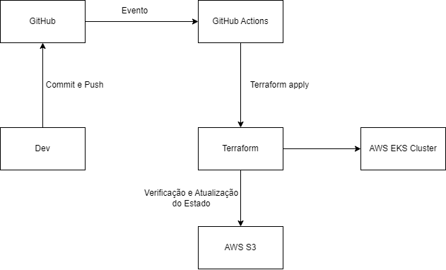

# Automation with Terraform

## Project Goal

The goal is to automate the process of creating and maintaining the environment for running Software projects.

## Project Assumptions

For the project's development, the following assumptions were made:

+ Use Terraform as an infrastructure-as-code tool.
+ The Kubernetes cluster must be created using AWS's Elastic Kubernetes Service (EKS).
+ The project should be as simple and reusable as possible.
+ Every time there is a change in the Terraform code on the main branch of the repository, the pipeline must be executed.
+ There will be only one Kubernetes environment (development, staging, and production environments will be separated by namespace).

## Functionalities

The project provisions a complete and robust infrastructure on AWS, ready to host containerized applications. The main features are:

*   **Networking:** Creation of a dedicated VPC with public and private subnets, ensuring the isolation and security of resources.
*   **Kubernetes Cluster (EKS):** Provisioning of an Amazon EKS (Elastic Kubernetes Service) cluster with a managed node group, offering a scalable and resilient container orchestration platform.
*   **Database (RDS):** Creation of an Amazon RDS database instance in a private subnet, ensuring data security and management.
*   **Load Balancer (ALB):** Configuration of an Application Load Balancer (ALB) and the `aws-load-balancer-controller` to securely and efficiently expose the services running on the Kubernetes cluster.
*   **Monitoring and Observability:**
    *   Implementation of **Amazon CloudWatch Container Insights** for detailed collection of performance metrics and logs from the cluster and applications.
    *   Use of the official **`amazon-cloudwatch-observability`** addon for native and optimized integration with EKS.
    *   Creation of multiple **dashboards** in CloudWatch for data visualization, allowing proactive monitoring and performance analysis.

## Technologies used in the project

+ [AWS](https://aws.amazon.com)
   + [S3](https://aws.amazon.com/s3)
   +  [EKS](https://aws.amazon.com/eks)
+ [AWS CLI](https://aws.amazon.com/cli/)
+ [Terraform](https://www.terraform.io)
    + [AWS Provider](https://registry.terraform.io/providers/hashicorp/aws)
    + [AWS VPC Terraform module](https://registry.terraform.io/modules/terraform-aws-modules/vpc/aws)
    + [AWS EKS Terraform module](https://registry.terraform.io/modules/terraform-aws-modules/eks/aws)
+ [GitHub](https://github.com)
    + [GitHub Actions](https://github.com/features/actions)

## Motivations for using each technology

+ **EKS** - Project requirement.
+ **S3** - Was adopted to store the current state of the Terraform project. Its use was defined because it is an AWS service and has version control of the files.
+ **GitHub Actions** - Project requirement.

## Instructions to run

The project creation or update pipeline is executed whenever the project's Terraform code is changed on the main branch.

## Settings
The project configuration variables are in the `terraform.tfvars` file, except for variables considered sensitive, which are in the GitHub Actions secrets manager.

**Variables stored in secrets:**

AWS_ACCESS_KEY_ID => Access Key used to configure the AWS CLI.

AWS_SECRET_ACCESS_KEY => Secret access Key used to configure the AWS CLI.

AWS_BUCKET_NAME => Name of the Bucket used to store the state of the Terraform project.

AWS_BUCKET_FILE => Name of the file used to store the state of the Terraform project.

## Solution structure

Flow Explanation

## Possible project evolutions

Some evolutions I suggest for the project:

+ Separate dev, staging, and prod environments using Terraform Workspace or Terraform Grunt for creating and managing these environments.
+ Use DynamoDB with S3 to avoid parallel execution of Terraform.
---

### Variable Naming:
    . General Naming Conventions
        .Case Patterns:
            . snake_case: For names of variables, resources, data sources
            . PascalCase: For names of resources and data sources types
            . 'UPPER_SNAKE_CASE: For constants or fixed values
    In this Project we will adopt "snake_case" for Variables
                               "UPPER_SNAKE_CASE" for Constants

---
### Examples:
# Variables (snake_case)
variable "instance_type" {}
variable "vpc_cidr_block" {}

# Resources (snake_case)
resource "aws_instance" "web_server" {}
resource "aws_s3_bucket" "data_bucket" {}

# Constants (UPPER_SNAKE_CASE)
locals {
  DEFAULT_REGION = "us-east-1"
  MAX_INSTANCES  = 10
}
---
September 3, 2025
## Implemented improvements:

1. Standardized naming (snake_case)
2. Centralized variables in terraform.tfvars
3. Automated Container Insights via null_resource
4. Correct IAM permissions for CloudWatch
5. Reusable code without specific suffixes
6. Creation of another Dashboard

---

## Recent Improvements

*   **Monitoring Modernization:** The implementation of the CloudWatch agent has been updated, replacing a `local-exec` script with the official AWS **`amazon-cloudwatch-observability`** addon. This makes the installation more robust, secure, and aligned with AWS best practices.
*   **Dynamic Dashboards:** The monitoring module has been enhanced to support the creation of multiple dashboards in CloudWatch from JSON template files, allowing the creation of rich and customized visualizations for different needs.
*   **Modular Structure:** The code has been refactored into a highly modular architecture, with components such as `eks`, `rds`, `networking`, and `monitoring` separated into their own modules, facilitating maintenance, reuse, and project scalability.
=======
### Creation of another Dashboard

This one using Templates, so that the code is reusable and Dynamic regardless of:
- User Account
- Region
- Cluster
- NameSpace

---

*   **Monitoring Modernization:** The implementation of the CloudWatch agent has been updated, replacing a `local-exec` script with the official AWS **`amazon-cloudwatch-observability`** addon. This makes the installation more robust, secure, and aligned with AWS best practices.
*   **Dynamic Dashboards:** The monitoring module has been enhanced to support the creation of multiple dashboards in CloudWatch from JSON template files, allowing the creation of rich and customized visualizations for different needs.
*   **Modular Structure:** The code has been refactored into a highly modular architecture, with components such as `eks`, `rds`, `networking`, and `monitoring` separated into their own modules, facilitating maintenance, reuse, and project scalability.

---

### Requests already Implemented:
- pre-commit: using docs - Documentation of the modules
- use English in README.md files
- pre-commit features:

=== [1] Running pre-commit for the first time ===
[https://github.com/pre-commit/pre-commit-hooks] already up to date!
[https://github.com/antonbabenko/pre-commit-terraform] already up to date!
[https://github.com/hadolint/hadolint] already up to date!
[https://github.com/adrienverge/yamllint.git] already up to date!
[https://github.com/rhysd/actionlint] already up to date!
Cleaned /home/junior/.cache/pre-commit.
pre-commit installed at .git/hooks/pre-commit
[INFO] Initializing environment for https://github.com/pre-commit/pre-commit-hooks.
[INFO] Initializing environment for https://github.com/antonbabenko/pre-commit-terraform.
[INFO] Initializing environment for https://github.com/hadolint/hadolint.
[INFO] Initializing environment for https://github.com/adrienverge/yamllint.git.
[INFO] Initializing environment for https://github.com/rhysd/actionlint.
[INFO] Installing environment for https://github.com/pre-commit/pre-commit-hooks.
[INFO] Once installed this environment will be reused.
[INFO] This may take a few minutes...
[INFO] Installing environment for https://github.com/adrienverge/yamllint.git.
[INFO] Once installed this environment will be reused.
[INFO] This may take a few minutes...
[INFO] Installing environment for https://github.com/rhysd/actionlint.
[INFO] Once installed this environment will be reused.
[INFO] This may take a few minutes...
trim trailing whitespace.................................................Failed
- hook id: trailing-whitespace
- exit code: 1
- files were modified by this hook

Fixing README.md

fix end of files.........................................................Passed
Terraform fmt............................................................Passed
Terraform validate.......................................................Passed
Terraform docs...........................................................Passed
Lint Dockerfiles.....................................(no files to check)Skipped
yamllint.................................................................Passed
Lint GitHub Actions workflow files...................(no files to check)Skipped
=== [2] Adding files modified by the hooks ===
=== [3] Running pre-commit again to ensure everything is clean ===
trim trailing whitespace.................................................Passed
fix end of files.........................................................Passed
Terraform fmt............................................................Passed
Terraform validate.......................................................Passed
Terraform docs...........................................................Passed
Lint Dockerfiles.....................................(no files to check)Skipped
yamllint.................................................................Passed
Lint GitHub Actions workflow files...................(no files to check)Skipped
=== [4] Adding final changes ===
=== [5] Committing ===
trim trailing whitespace.................................................Passed
fix end of files.........................................................Passed
Terraform fmt........................................(no files to check)Skipped
Terraform validate...................................(no files to check)Skipped
Terraform docs.......................................(no files to check)Skipped
Lint Dockerfiles.....................................(no files to check)Skipped
yamllint.............................................(no files to check)Skipped
Lint GitHub Actions workflow files...................(no files to check)Skipped
[temp_branch 17dbd9a] docs = README.md
 1 file changed, 9 insertions(+)
=== [6] Commit successful! ===
Message: docs = README.md

Do you want to git push to remote? [y/N]: y
=== [7] Executing git push ===
Enumerating objects: 5, done.
Counting objects: 100% (5/5), done.
Delta compression using up to 8 threads
Compressing objects: 100% (3/3), done.
Writing objects: 100% (3/3), 457 bytes | 457.00 KiB/s, done.
Total 3 (delta 2), reused 0 (delta 0), pack-reused 0
remote: Resolving deltas: 100% (2/2), completed with 2 local objects.
To https://github.com/crfjunior65/Plataforma-Bet.git
   0d0bafa..17dbd9a  temp_branch -> temp_branch
branch 'temp_branch' set up to track 'origin/temp_branch'.
=== Push complete ===

---

Procedures to be Executed:
### Code and Repository standardization improvements
1. Naming standardization (snake_case).
2. Terraform Code Directory, terraform-aws definition
3. Definition of Branches (homologation / production(main) / stage)
4. Commit:
   1. NEW THING: "feat = add subnet"
   2. FIX: "fix = terraform fmt"
   3. RESTRUCTURING: "refactore = change to modules"
   4. COMMENTS: "docs = add README.md"
   5. CHANGE: "change = change s3 bucket name"
   6. REQUEST: "chore = create s3 bucket"

---
